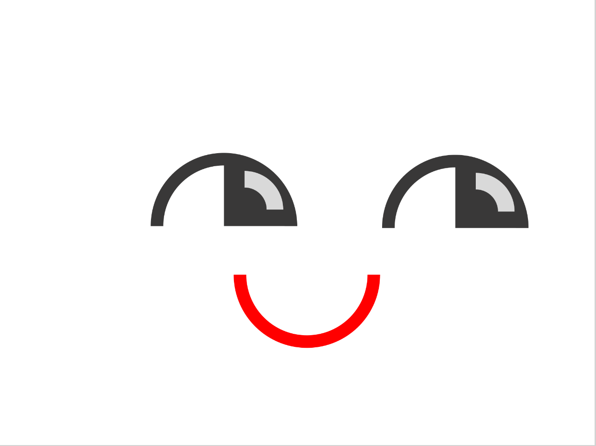

SUPSI 2022-23  
Corso d’interaction design, CV427.01  
Docenti: A. Gysin, G. Profeta  

Elaborato 1: Marionetta digitale  

# Smile
Autore: Arianna Stöckli
[MediaPipe demo-ES6](https://ariannastockli.github.io/marionetta_faccia/)

## Introduzione e tema
Il progetto consisteva nel realizzare una marionetta digitale, in realtà aumentata applicata sulla mano. La marionetta doveva rappresentare un personaggio inventato con un proprio carattere o reale.
Attraverso l’utilizzo della videocamera e dei punti assegnati alle dita della mano, è stato possibile creare un personaggio con tutte le sue caratteristiche fisiche.

## Riferimenti progettuali
https://cdn.dribbble.com/users/537941/screenshots/4308457/media/f318edfe3ecb9504c654a0d42d400f6f.gif

## Design dell’interfraccia e modalià di interazione
Ho creato tre stati emozionali per il mio personaggio: un’espressione felice, un’espressione sorpresa e un’espressione addormentata. Quando la mano della persona è completamente aperta, la faccina appare normale, con un’espressione sorridente.
Quando l’indice e il mignolo si avvicinano, corrispondenti agli occhi del personaggio, l’immagine cambia e gli occhi si chiudono, suggerendo che il personaggio stia dormendo. Per accentuare questo stato, ho aggiunto un’interazione con il trackpad, in modo che al clic il colore dello sfondo diventi grigio scuro, come se la luce fosse spenta.
Quando il medio e il pollice si avvicinano, la bocca si apre e gli occhi si spalancano, dando vita all’espressione di sorpresa.
Il movimento degli occhi cambia in base alla posizione orizzontale della mano rispetto al canvas. Quando la mano si sposta verso la destra, gli occhi del personaggio guardano verso destra e viceversa quando la mano si sposta verso sinistra.
Per quanto riguarda il design, ho utilizzato forme geometriche semplici, come archi e cerchi per realizzare il volto del personaggio.

## Tecnologia usata
Il codice utilizza diverse funzioni di p5.js per creare il canvas grafico, disegnare le immagini delle mani, della bocca e degli occhi, e gestire gli eventi di interazione dell’utente.
Sono state utilizzate condizioni if e else per gestire il comportamento dell’applicazione in base alle posizioni delle mani rilevate e alle interazioni dell’utente.

La condizione if (sfondoScuro) controlla se la variabile booleana sfondoScuro è vera. Se sfondoScuro è true, allora lo sfondo del canvas viene impostato su grigio scuro utilizzando la funzione background(50), altrimenti viene impostato su bianco utilizzando la funzione background(255).

La funzione mouseClicked() viene chiamata quando si fa clic sul canvas e viene utilizzata per invertire il valore della variabile sfondoScuro, che controlla se lo sfondo dell’applicazione deve essere scuro o chiaro.

La condizione if (ditaSeparate) controlla se le dita dell’indice e del mignolo della mano rilevata sono separate. Viene calcolata la distanza tra le coordinate dell’indice e del mignolo utilizzando la funzione dist() e se questa distanza è inferiore a 200, allora ditaSeparate sarà true.
Se ditaSeparate è true, viene mostrata un’immagine dell’occhio chiuso per l’indice e il mignolo della mano.

La condizione if (posMedia.x < width/2) controlla se la posizione media tra le coordinate dell’indice e del mignolo della mano rilevata è a sinistra del canvas. Se è vero, viene mostrata un’immagine dell’occhio sinistro per l’indice e il mignolo della mano, altrimenti viene mostrata un’immagine dell’occhio destro.

La condizione if (distPolliceMedio < 50) controlla se la distanza tra le coordinate del pollice e del medio della mano rilevata è inferiore a 50. Se è vero, significa che il pollice e il medio sono molto vicini e in tal caso, viene mostrata un’immagine della bocca aperta insieme all’occhio aperto corrispondente (sinistro o destro, a seconda della posizione della mano sul canvas), altrimenti viene mostrata un’immagine della bocca chiusa.

## Target e contesto d’uso
Il target della mia marionetta digitale potrebbe essere costituito da bambini di un età tra i cinque e i dodici anni. Potrebbe essere realizzata con lo scopo di intrattenere i bambini in contesti come spettacoli per la loro età, programmi televisivi, cartoni animati interattivi, parchi giochi o eventi per famiglie.
La marionetta digitale potrebbe essere utilizzata per rendere più interattiva l’esperienza del quiz televisivo per i bambini, consentendo loro di utilizzare la mano o i gesti per rispondere alle domande o per partecipare alle attività del quiz, rendendo l’esperienza più divertente e coinvolgente.
